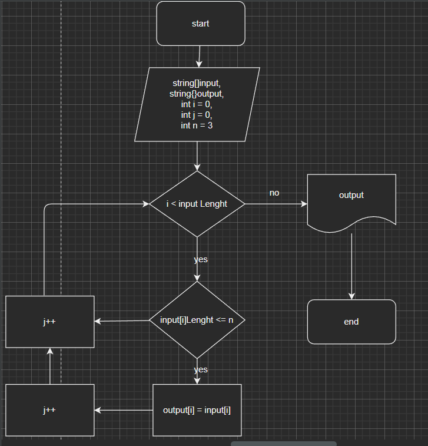

Задача:

Написать программу, которая из имеющегося массива формирует из строк, длина которох меньше, либо равна 3 символа. 
Первоначальный массив можно ввести с клавиатуры, либо задать на старте выполнения алгоритма.

При решении не рекомендуется пользоваться коллекциями, лучше обойтись исключительно массивами.
Алгоритм решения
    Перебираем значения исходного массива.
    Проверяем каждое знаение массива по очереди на соответствие условию: длина строки меньше или равна трем (3).
    Если условия выполняются выбранной строкой из исходного массива, то данное значение переносим в новый массив.
    Повторяем пункты 2 и 3 до тех пор пока не достигнем конца исходного массива.
    Возращаем новый заполненый массив как результат.

Блок-схема алгоритма
